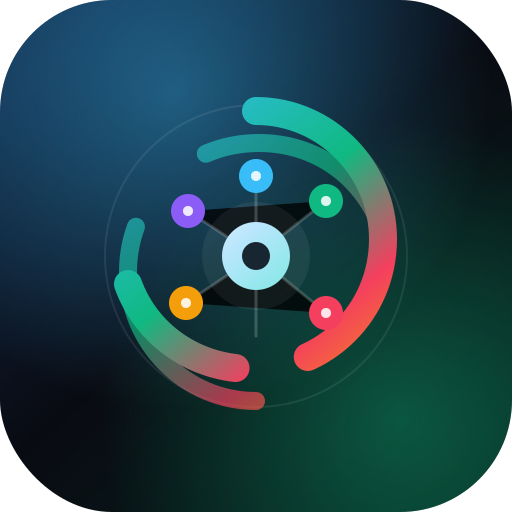

<p align="center">
  
</p>

<h1 align="center">SelfOS</h1>

<p align="center">
  <strong>Un personal operating system self-hosted per note, task, finanze, education, fitness, obiettivi e automazioni.</strong>
</p>

<p align="center">
  
  
  
  
  
  
</p>

---

## Indice

- [Panoramica](#panoramica)
- [Funzionalita](#funzionalita)
- [Tech stack](#tech-stack)
- [Architettura](#architettura)
- [Quick start](#quick-start)
- [Variabili ambiente](#variabili-ambiente)
- [Database e migrazioni](#database-e-migrazioni)
- [Script disponibili](#script-disponibili)
- [Deploy](#deploy)
- [Sicurezza e privacy](#sicurezza-e-privacy)
- [Struttura progetto](#struttura-progetto)
- [Scorciatoie](#scorciatoie)
- [Stato della repo](#stato-della-repo)

---

## Panoramica

**SelfOS** e una Progressive Web App full-stack pensata come centro di controllo personale self-hosted. Unisce strumenti che normalmente vivono in app separate: un secondo cervello per note e conoscenza, un task manager, un cruscotto finanziario, un tracker fitness con AI coach, un modulo education configurabile, un sistema obiettivi e uno studio per automazioni personali.

L'app e costruita per uso personale o self-hosted: autenticazione Supabase, dati isolati con Row Level Security, PWA installabile, tema chiaro/scuro, supporto mobile e API server-side per integrazioni sensibili.

```text
SelfOS
|-- Home & Command Center
|-- Note, notebook, backlinks, condivisione
|-- Task, progetti, subtask, Kanban, calendario
|-- Finanze, budget, patrimonio, ETF, scenari
|-- Fitness, Strava, metriche, training load, Coach AI
|-- Education, esami, crediti, media, proiezioni
|-- Goal OS, automazioni, inbox universale
`-- PWA, export, notifiche, sicurezza
```

### What I built

SelfOS nasce come progetto personale, ma la repo e preparata per essere letta come portfolio tecnico:

- **Full-stack product work:** App Router, Server Components, API Routes, Supabase Auth/Postgres/RLS e PWA.
- **Privacy-first architecture:** dati utente isolati da policy RLS, segreti solo server-side e service worker che non mette in cache dati personali.
- **Domain depth:** editor Tiptap con backlink, dashboard operative, finance tracker, fitness analytics, AI workflows e integrazioni OAuth/API.
- **Modular self-hosting:** i moduli possono essere abilitati o nascosti via env senza cambiare codice applicativo.

### Moduli configurabili

Per default tutti i moduli sono attivi. In una installazione self-hosted puoi limitare la superficie dell'app con:

```bash
NEXT_PUBLIC_SELFOS_MODULES=notes,tasks,goals,finance,fitness,education,automation
# oppure
NEXT_PUBLIC_SELFOS_DISABLED_MODULES=education,finance
```

I moduli supportati sono `notes`, `tasks`, `goals`, `finance`, `fitness`, `education` e `automation`. La UI principale, la sidebar, la Command Palette, l'Inbox universale, la Home e la Guida rispettano questa configurazione.

### Demo senza dati personali

La repo non contiene dati reali. Per preparare una demo portfolio:

1. crea un utente Supabase dedicato;
2. importa solo dati sintetici o aggiungi manualmente poche note/task/esami/workout fittizi;
3. lascia non configurate le integrazioni esterne che non vuoi mostrare;
4. acquisisci screenshot dopo aver verificato che nessun nome, email, token o dato finanziario reale sia visibile.

---

## Funzionalita

### Home e Command Center

| Funzionalita | Dettaglio |
|---|---|
| **Dashboard aggregata** | Sintesi di note recenti, note fissate, task, promemoria, finanze, fitness e scadenze. |
| **Briefing operativo** | Il Command Center fonde task, goal, soldi, studio, fitness e automazioni in una vista unica. |
| **Segnali prossimi** | Evidenzia reminder, task in ritardo, scadenze finanziarie, esami e obiettivi fuori traiettoria. |
| **Modalita operative** | Calcola un carico di focus e distingue tra costruzione, execution e contenimento. |
| **Navigazione veloce** | Link rapidi ai moduli principali e azioni frequenti. |

### Note e secondo cervello

| Funzionalita | Dettaglio |
|---|---|
| **Editor rich-text** | Editor Tiptap con heading, grassetto, corsivo, barrato, codice, quote, liste, task list e tabelle. |
| **Backlinks** | Collegamenti bidirezionali con sintassi `[[Nome nota]]` e pannello dedicato ai backlink. |
| **Notebook gerarchici** | Organizzazione per notebook, inclusi colori, emoji e drag & drop delle note nei notebook. |
| **Ricerca** | Filtri per titolo e contenuto, anteprime e risultati evidenziati. |
| **Pin e colori** | Note fissate, bordo colorato, emoji e metadati visuali per scansione rapida. |
| **Tag** | Aggiunta e rimozione tag direttamente dall'editor. |
| **Template** | Creazione e riuso di modelli di nota. |
| **Media** | Upload immagini, drag & drop, incolla da clipboard e lightbox fullscreen. |
| **Outline** | Pannello dei titoli per muoversi dentro note lunghe. |
| **Versioni** | Storico versioni e ripristino del contenuto precedente. |
| **Promemoria** | Reminder sulle note, watcher notifiche e alert nella dashboard. |
| **Pomodoro** | Timer 25/5 con sessioni focus e notifiche browser. |
| **Export nota** | Esportazione in Markdown e PDF tramite stampa browser. |
| **Condivisione pubblica** | Link pubblici revocabili su `/share/[token]`, con rendering sanitizzato. |
| **Cestino** | Soft delete, ripristino note ed eliminazione permanente separata. |

### Task e progetti

| Funzionalita | Dettaglio |
|---|---|
| **Quick add** | Creazione rapida di task con priorita. |
| **Progetti** | Raggruppamento con colore, emoji e archivio. |
| **Priorita** | Urgente, alta, media e bassa con ordinamento dedicato. |
| **Stati** | `todo`, `in_progress`, `done` con completamento tracciato. |
| **Viste multiple** | Lista, Kanban, calendario e vista "oggi". |
| **Filtri** | Ricerca, progetto, priorita, tag e task completati. |
| **Subtask** | Checklist annidate e progresso nel dettaglio task. |
| **Ricorrenze** | Task giornalieri, settimanali o mensili con nuova istanza al completamento. |
| **Scadenze** | Evidenza di task di oggi, domani e scaduti. |
| **Link alle note** | Collegamento tra task e note del secondo cervello. |

### Finanze personali

| Funzionalita | Dettaglio |
|---|---|
| **Conti multi-tipo** | Conti correnti, risparmi, investimenti e altre categorie patrimoniali. |
| **Snapshot saldi** | Tracciamento mensile dei saldi per conto. |
| **Patrimonio netto** | Calcolo asset, liquidita, debiti residui e net worth. |
| **Entrate mensili** | Entrate per mese, con supporto a mese di budget separato dal mese di incasso. |
| **Budget cycle** | Pianificazione risparmio e spesa variabile mensile. |
| **Spese ricorrenti** | Mensili, trimestrali e annuali con impatto mensile normalizzato. |
| **Impegni finanziari** | Mutui, prestiti, rate, debiti e obiettivi finanziari con scadenze. |
| **Auto pagamenti** | Applicazione automatica delle rate dovute per impegni configurati. |
| **Portfolio ETF** | Strumenti, prezzi, transazioni buy/sell, posizioni, P&L e valore per conto. |
| **PAC ricorrenti** | Piani di investimento automatici con applicazione dei piani dovuti. |
| **Prezzi ETF** | Sync prezzi via Twelve Data, manuale o via endpoint cron protetto. |
| **Analytics** | Grafici Recharts per saldo, entrate, spese dedotte, patrimonio e composizione. |
| **Scenari** | Planner per traiettorie finanziarie e simulazioni personali. |
| **Note mensili** | Annotazioni contestuali sui mesi finanziari. |

### Fitness e Coach AI

| Funzionalita | Dettaglio |
|---|---|
| **Allenamenti** | Log manuale con distanza, durata, passo, FC, cadenza, dislivello, passi, sensazione e note. |
| **Tipi workout** | Corsa facile, tempo, intervalli, lungo, recupero, gara, camminata, ciclismo e altro. |
| **AI Vision** | Upload screenshot da app fitness: l'AI estrae dati strutturati e li propone all'utente. |
| **Review AI** | Feedback breve del coach sul singolo allenamento con contesto dello storico recente. |
| **Coach AI** | Generazione di piani settimanali personalizzati, basati su storico e preferenze. |
| **Pianificato vs reale** | Confronto tra planned workouts e workout completati. |
| **Training load** | Calcolo TRIMP, CTL, ATL, TSB, monotonia, strain, ACWR, forma e rischio. |
| **Strava** | OAuth, stato connessione, sync attivita, refresh token e mapping dei workout. |
| **Metriche corpo** | Peso, altezza, body fat, resting HR, BMI, massa magra/grassa e trend. |
| **Achievement** | Badge per costanza, chilometri, distanze milestone, body tracking e screenshot import. |
| **Grafici** | Trend su allenamenti, metriche corpo e carico. |

### Education

| Funzionalita | Dettaglio |
|---|---|
| **Percorso configurabile** | Nome percorso, studente opzionale, crediti totali, bonus finale e valore lode. |
| **Registro esami** | Esami per anno, crediti, voto, lode, area, data e ordinamento. |
| **Stati esame** | Da sostenere, prenotato, online svolto e convalidato. |
| **Tipi esame** | Obbligatorio o a scelta. |
| **Import JSON** | Import di esami da file con normalizzazione di stato e data. |
| **Filtri** | Tutti, ufficiali, online e mancanti. |
| **Media e crediti** | Calcolo media ponderata, crediti acquisiti e progressione. |
| **Proiezioni** | Simulazioni con valore lode configurabile e avanzamento verso obiettivi. |
| **Transizioni guidate** | Azioni rapide per prenotare, segnare online e convalidare esami. |

### Goal Operating System

| Funzionalita | Dettaglio |
|---|---|
| **Obiettivi misurabili** | Titolo, area, orizzonte, valore corrente, target, unita e scadenza. |
| **Aree di vita** | Salute, soldi, studio, lavoro, relazioni e crescita. |
| **Orizzonti** | Mese, trimestre, anno e visione. |
| **Progress tracking** | Percentuale di avanzamento e media degli obiettivi attivi. |
| **Rischio** | Obiettivi scaduti o fuori traiettoria evidenziati nel Command Center. |
| **Link ai progetti** | Collegamento tra obiettivi e progetti operativi. |
| **Archivio completati** | Stato completato e conteggio delle prove raggiunte. |

### Automation Studio

| Funzionalita | Dettaglio |
|---|---|
| **Regole personali** | Creazione di regole leggibili "quando/allora". |
| **Trigger** | Briefing giornaliero, task in ritardo, goal a rischio, scadenze finanziarie, abitudine saltata. |
| **Azioni** | Mostra nel Command Center, crea task, alza priorita, suggerisci review. |
| **Toggle** | Attiva/disattiva automazioni senza eliminarle. |
| **Metriche** | Conteggio regole, attive ed esecuzioni. |

### Inbox universale

| Funzionalita | Dettaglio |
|---|---|
| **Cattura rapida** | Overlay globale richiamabile da tastiera. |
| **Parsing intelligente** | Interpreta testo libero e lo converte in bozza strutturata. |
| **Destinazioni** | Nota, task, workout, entrata finanziaria o milestone education. |
| **Override manuale** | Possibilita di cambiare tipo prima del salvataggio. |
| **Routing post-save** | Dopo il salvataggio porta al modulo corretto. |

### PWA, UX e sistema

| Funzionalita | Dettaglio |
|---|---|
| **Installabile** | Manifest PWA con start URL `/home`, icone e shortcut. |
| **Offline fallback** | Service worker, pagina `/offline` e banner stato rete. |
| **Aggiornamenti** | Rilevamento nuova versione e toast di refresh. |
| **Tema** | Tema chiaro/scuro persistito in localStorage. |
| **Responsive** | Sidebar desktop, navigazione mobile e safe-area per iOS. |
| **Command Palette** | `Cmd/Ctrl + K` per cercare note, creare note e navigare. |
| **Notifiche** | Impostazioni per notifiche browser e watcher reminder. |
| **Export dati** | Export JSON completo da impostazioni. |
| **Profilo** | Modifica display name e gestione sessione. |
| **Help in-app** | Documentazione interna con scorciatoie e spiegazione dei moduli. |

---

## Tech stack

| Area | Tecnologie |
|---|---|
| **Framework** | Next.js 16 App Router, React 19, Server Components, API Routes |
| **Linguaggio** | TypeScript 5 |
| **UI** | Tailwind CSS 4, CSS custom properties, lucide-react, Sonner |
| **Editor** | Tiptap 3 con estensioni custom per note link e immagini |
| **Grafici** | Recharts con import dinamici |
| **Database** | Supabase PostgreSQL, Auth, RLS, migrazioni SQL |
| **AI** | Client provider-agnostic per Anthropic e OpenAI compatibile |
| **Integrazioni** | Strava OAuth/API, Twelve Data |
| **PWA** | Manifest, service worker custom, pagina offline |
| **Sicurezza** | CSP, HSTS, cookie hardening, DOMPurify, rate limiting |

---

## Architettura

```text
Browser / PWA
     |
     | HTTPS
     v
Next.js App Router
|-- Server Components per pagine protette
|-- API Routes per mutazioni e integrazioni
|-- Middleware / layout auth
|-- Service worker e manifest
     |
     +--> Supabase Auth + PostgreSQL + RLS
     +--> AI provider (Anthropic / OpenAI)
     +--> Strava API
     `--> Twelve Data API
```

Il client usa Supabase con `anon key`, mentre le chiavi sensibili restano server-side nelle route API. Le query applicative sono sempre filtrate per utente e le tabelle Supabase hanno policy RLS basate su `auth.uid()`.

### Architecture highlights

- **Server-first data loading:** le pagine protette leggono i dati con Server Components e passano ai client component solo il payload necessario alla UI.
- **API boundary chiaro:** mutazioni, OAuth, AI e sync esterni passano da Route Handler server-side.
- **Module registry:** navigazione, Inbox, Home, Command Palette e Settings leggono una configurazione moduli condivisa.
- **Graceful degradation:** AI, Strava e Twelve Data sono opzionali; senza env dedicate le feature restano disattivate o mostrano errori configurabili.
- **Self-hosted by design:** la repo privilegia setup esplicito, segreti locali e controllo totale dei dati.

---

## Quick start

### Prerequisiti

- Node.js `>= 20`
- npm
- Un progetto Supabase
- Facoltativo: chiave Anthropic/OpenAI per funzioni AI
- Facoltativo: Strava e Twelve Data per le relative integrazioni

### Installazione locale

```bash
git clone https://github.com/lustri2002/selfos.git
cd selfos
npm install
cp .env.example .env.local
npm run dev
```

Apri [http://localhost:3000](http://localhost:3000). L'app reindirizza al login se non esiste una sessione attiva.

### Setup Supabase minimo

1. Crea un progetto su [supabase.com](https://supabase.com).
2. Copia `Project URL` e `anon public key` in `.env.local`.
3. Esegui le migrazioni SQL in `supabase/migrations/` in ordine numerico.
4. Configura Auth secondo il tuo modello di accesso:
   - repo personale: crea manualmente gli utenti e disabilita signup pubblico;
   - istanza condivisa: lascia signup controllato e verifica le policy.
5. Avvia l'app con `npm run dev`.

Per una guida piu operativa, vedi [SETUP.md](SETUP.md) e [docs/DEPLOYMENT.md](docs/DEPLOYMENT.md).
Per preparare screenshot portfolio senza dati reali, vedi [docs/DEMO.md](docs/DEMO.md).

---

## Variabili ambiente

Le variabili minime sono quelle Supabase:

```bash
NEXT_PUBLIC_SUPABASE_URL=https://your-project-id.supabase.co
NEXT_PUBLIC_SUPABASE_ANON_KEY=
```

Variabili consigliate o opzionali:

| Variabile | Necessaria | Uso |
|---|---:|---|
| `NEXT_PUBLIC_SUPABASE_URL` | Si | URL pubblico del progetto Supabase. |
| `NEXT_PUBLIC_SUPABASE_ANON_KEY` | Si | Chiave anon pubblica, protetta da RLS. |
| `SUPABASE_SERVICE_ROLE_KEY` | No | Accesso admin server-side, solo se abiliti funzioni che lo richiedono. |
| `APP_ORIGIN` | No | Origin pubblico usato per link assoluti, fallback a request origin. |
| `NEXT_PUBLIC_APP_ORIGIN` | No | Variante pubblica dell'origin, se serve al client. |
| `NEXT_PUBLIC_SELFOS_MODULES` | No | Allowlist pubblica dei moduli attivi, separati da virgola. |
| `NEXT_PUBLIC_SELFOS_DISABLED_MODULES` | No | Lista pubblica dei moduli da nascondere, separati da virgola. |
| `APP_ENC_KEY` | No | Chiave base64 32 byte per cifrare segreti applicativi server-side. |
| `ANTHROPIC_API_KEY` | No | AI Vision, Coach AI e Review AI con config predefinita. |
| `OPENAI_API_KEY` | No | Alternativa se modifichi `config/ai.ts`. |
| `STRAVA_CLIENT_ID` | No | OAuth Strava. |
| `STRAVA_CLIENT_SECRET` | No | OAuth Strava server-side. |
| `STRAVA_REDIRECT_URI` | No | Callback Strava, es. `https://dominio.it/api/fitness/strava/callback`. |
| `TWELVE_DATA_API_KEY` | No | Aggiornamento prezzi ETF. |
| `FINANCE_CRON_SECRET` | No | Segreto per endpoint cron investimenti. |

La configurazione AI e centralizzata in [config/ai.ts](config/ai.ts). Cambiare provider o modello richiede di modificare quel file e impostare la chiave corrispondente.

---

## Database e migrazioni

Le migrazioni vivono in [supabase/migrations](supabase/migrations) e coprono:

- schema iniziale per note, notebook, conti, snapshot, ricorrenti, impegni e fitness;
- note fissate, condivisione pubblica, versioni, cestino e template;
- reminder, colori, notebook annidati e task manager;
- progetti condivisi, entrate mensili e note finanziarie;
- abitudini fitness, piani, planned workouts e metriche corpo;
- Strava, workout estesi, AI feedback e vincoli dati;
- modulo education, esami, stati e deduplica;
- Goal OS e automazioni;
- budget mensile e portfolio ETF.

Esegui sempre i file in ordine numerico. Se usi Supabase CLI puoi adattare il workflow a `supabase db push`; in alternativa il SQL Editor della dashboard e sufficiente per una istanza personale.

---

## Script disponibili

| Script | Descrizione |
|---|---|
| `npm run dev` | Avvia Next.js in sviluppo. |
| `npm run build` | Crea la build di produzione. |
| `npm run start` | Avvia la build di produzione. |
| `npm run lint` | Esegue ESLint. |
| `npm run deploy` | Esegue lo script Bash in `scripts/deploy.sh`. |

---

## Deploy

### Vercel

1. Importa la repo su Vercel.
2. Imposta le variabili ambiente.
3. Esegui le migrazioni su Supabase.
4. Configura eventuali callback:
   - Strava: `/api/fitness/strava/callback`
   - Supabase Auth callback: `/auth/callback`
5. Fai deploy.

Per Vercel Cron o un scheduler esterno puoi chiamare:

```text
POST /api/finance/investments/cron
Authorization: Bearer <FINANCE_CRON_SECRET>
```

### VPS / self-hosted

```bash
npm install
npm run build
npm run start
```

In produzione usa HTTPS, reverse proxy, variabili ambiente server-side e backup del database. La guida completa e in [docs/DEPLOYMENT.md](docs/DEPLOYMENT.md).

---

## Sicurezza e privacy

SelfOS gestisce dati personali sensibili. Le difese principali sono:

| Layer | Protezione |
|---|---|
| **Auth** | Supabase Auth, route protette, session cookie sicuri. |
| **Database** | Row Level Security su tabelle utente. |
| **API** | `requireUser`, allowlist campi, rate limit su endpoint AI/sync. |
| **Browser** | CSP, HSTS, `X-Frame-Options`, `Referrer-Policy`, `Permissions-Policy`. |
| **XSS** | DOMPurify e escaping su pagine condivise/export. |
| **PWA** | API e dati personali esclusi dalla cache del service worker. |
| **Segreti** | Chiavi AI, Strava, Twelve Data e service role solo server-side. |

Prima di rendere pubblica una istanza o una repo:

- non committare `.env.local` o chiavi reali;
- ruota eventuali segreti esposti in passato;
- decidi se pubblicare una licenza open source;
- verifica che Supabase signup sia coerente con il tipo di istanza;
- controlla le callback OAuth e gli origin consentiti.

---

## Struttura progetto

```text
selfos/
|-- app/
|   |-- (auth)/                 # Login e layout auth
|   |-- (protected)/            # Pagine protette
|   |   |-- home/               # Dashboard personale
|   |   |-- command/            # Command Center
|   |   |-- notes/              # Note e editor
|   |   |-- tasks/              # Task manager
|   |   |-- finance/            # Dashboard finanze
|   |   |-- fitness/            # Fitness tracker
|   |   |-- university/         # Education record
|   |   |-- goals/              # Goal OS
|   |   |-- automation/         # Automation Studio
|   |   |-- trash/              # Cestino note
|   |   |-- settings/           # Profilo, export, notifiche
|   |   `-- help/               # Help in-app
|   |-- api/                    # Route API
|   |-- auth/                   # Login/logout/callback
|   |-- share/[token]/          # Note condivise pubbliche
|   `-- offline/                # Fallback PWA
|-- components/
|   |-- ui/                     # Componenti condivisi
|   |-- notes/                  # Editor, lista, reminder, Pomodoro
|   |-- tasks/                  # TaskManager
|   |-- finance/                # FinanceDashboard
|   |-- fitness/                # FitnessTracker
|   |-- university/             # UniversityDashboard
|   |-- goals/                  # GoalsOperatingSystem
|   |-- automation/             # AutomationStudio
|   |-- command/                # CommandCenter
|   |-- inbox/                  # UniversalInbox
|   `-- notifications/          # Notifiche browser
|-- lib/
|   |-- supabase/               # Client server/browser/admin
|   |-- ai/                     # Client AI provider-agnostic
|   |-- finance/                # Formatter e logica investimenti
|   |-- fitness/                # Formatter fitness
|   |-- tiptap/                 # Estensioni custom editor
|   |-- inbox/                  # Parser inbox universale
|   |-- strava.ts               # Client Strava
|   |-- training-load.ts        # Metriche carico allenamento
|   `-- crypto.ts               # Cifratura segreti
|-- config/ai.ts                # Provider e modelli AI
|-- supabase/migrations/        # Migrazioni SQL
|-- types/database.ts           # Tipi Supabase
|-- public/                     # Manifest, service worker, icone
|-- docs/DEPLOYMENT.md          # Guida produzione
`-- SETUP.md                    # Setup rapido
```

---

## Scorciatoie

| Scorciatoia | Azione |
|---|---|
| `Cmd/Ctrl + K` | Apri Command Palette. |
| `Cmd/Ctrl + Shift + I` | Apri Inbox universale. |
| `Cmd/Ctrl + S` | Salva nota. |
| `Cmd/Ctrl + B` | Grassetto nell'editor. |
| `Cmd/Ctrl + I` | Corsivo nell'editor. |
| `Cmd/Ctrl + E` | Codice inline nell'editor. |
| `Cmd/Ctrl + Shift + S` | Barrato nell'editor. |
| `Esc` | Chiude palette, lightbox e menu contestuali. |

---

## Stato della repo

Il progetto nasce come sistema personale self-hosted. E pubblicabile come repo GitHub, ma prima di dichiararlo open source conviene aggiungere:

- un file `LICENSE`;
- screenshot o demo GIF in `public/` o `docs/`;
- una policy minima per issue/contributi se vuoi accettare contributi esterni;
- eventuali note sui provider esterni usati in produzione.

---

<p align="center">
  <sub>Built with Next.js, Supabase, Tiptap, Tailwind CSS and AI provider integrations.</sub>
</p>
